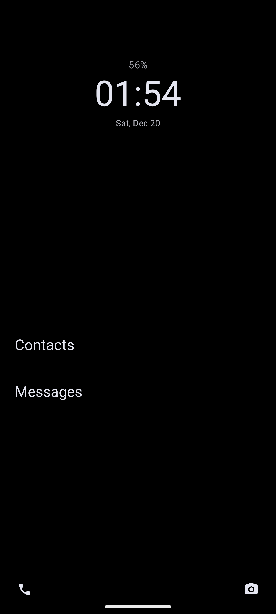

# Android Minimalist Launcher

A distraction-free Android launcher focused on simplicity and essential interactions. Built entirely using [github/spec-kit](https://github.com/github/spec-kit) to explore spec-driven development with Android/Kotlin.

## Features

- **Clean Home Screen**: Displays only time, date, and favorite apps
- **Smart Battery Indicator**: Circular indicator around camera notch (Pixel 8 Pro) that appears only when battery is below 50%
- **Gesture Navigation**: 
  - Swipe right-to-left for app search
  - Swipe left-to-right in search to return to home (with smooth animation)
  - Swipe up for device search
  - Swipe down for notifications
- **Favorite Apps Management**: Long-press apps in search to add/remove from home screen
- **Quick Actions**: Bottom corner shortcuts for phone and camera apps with press animations
- **Clock Quick Access**: Tap time/date display to instantly open your alarm/clock app
- **Smooth Animations**: Modern micro-interactions and 60fps transitions throughout
- **Distraction-Free**: No widgets, no clutter, just what you need

> **Note**: This launcher is part of a personal journey to reduce phone distractions and spend less time mindlessly scrolling. By removing visual clutter and making apps deliberately accessible through search, it encourages more intentional phone usage.

## Development Journey

The goal of this project was to experience spec driven development with:
* An eco-system I haven't coded for in 10 years (Android);
* A programming language I have never tried (Kotlin);
* A stack I've never been profecient with (Mobile);

## Future features

* More polishing, the battery indicator should not display the grey'ish complete circle, only the actual % of the circle should be showing. When charging, the circle should have an animation to indicate charging, like the % circle should be constantly filling up 
* Have whatsapp on the bottom right instead of camera? Maybe a setting for this?
* **Settings Menu**: Toggle auto-launch and other preferences
* **Dynamic Backgrounds**: Automatic background generation (exploring generative art)
